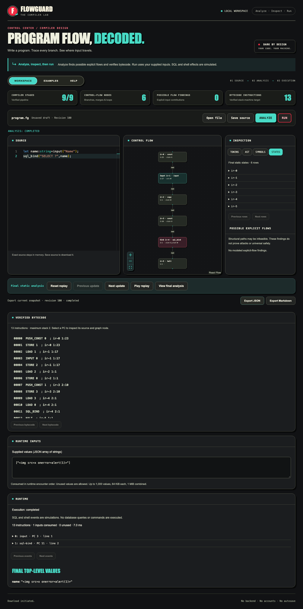

# FlowGuard

**A visual compiler and static analyzer that explains unsafe input flow.**

FlowGuard is the Innovative Assignment for **4CS501CC25 Principles of Compiler Design**. It connects compiler fundamentals with possible injection-related flows and an explicitly simulated bytecode runtime.

## Current Status

**Phases 0–4 technical work is published on canonical main.** Phase 4 implementation/evidence commit: `164b94a`. Analyze completes the full compiler, explicit-flow analysis, codegen and verifier pipeline. Explicit Run executes verified bytecode with supplied inputs in a bounded VM. SQL and shell effects are simulated.

The workspace links source, control flow, findings, analysis replay, bytecode and runtime events. CLI and browser use the same TypeScript core. Final initialized top-level values exclude block locals and temporary slots. Phase 4 adds deterministic evaluation, measured benchmarks, release checks, an assignment report and a repeatable demo. Human rehearsal and faculty submission remain separate gates; actual publication/CI evidence is recorded below.



The current UI uses dark charcoal cards, blue-green/red accents, bold headings and pill navigation, with matching dark editor/graph themes. Summary counts come from the current analysis. Harsh approved publication of this visual refresh on 8 October 2026; prior Phase 4 benchmarks retain their original measured source hashes.

## Local Setup

Use **Node.js 26.5.0** and **npm 11.17.0**. From the repository root:

```sh
npm ci
npm run dev
```

Open [the local workspace](http://127.0.0.1:5173). Drafts live only in memory and disappear on reload. No account, database, backend analysis service, autosave, or remote runtime API is used.

## Validation

```sh
npm run typecheck
npm run test
npm run build
npx playwright install chromium
npm run test:e2e
```

Or run `npm run check` after the browser installation. Phase 4 local checks passed **260 unit/CLI tests, fifteen production Chromium tests, four isolated static-integration Chromium tests, typechecks and builds** with Node 26.5.0/npm 11.17.0. `npm run test:phase2` runs the existing isolated harness. [Testing notes](docs/testing.md) record the full-check evidence and approved scope-metadata amendment. [GitHub Actions run 37660826256](https://github.com/harshshah-24/FlowGuard/actions/runs/37660826256) passed for implementation commit `9b3e96c`: clean install, typechecks, unit/CLI tests, production build and both Chromium suites on Ubuntu.

CLI after building:

```sh
node packages/cli/dist/main.js --version
node packages/cli/dist/main.js --help
node packages/cli/dist/main.js examples/unsafe-query.fg --trace
node packages/cli/dist/main.js examples/bound-query.fg --format markdown --output report.md
node packages/cli/dist/main.js examples/arithmetic-loop.fg --run
node packages/cli/dist/main.js examples/bound-query.fg --run --inputs inputs.json
```

For example, `inputs.json` can contain `["Ada"]`. Exit codes: 0 completed without findings, 1 completed with findings, 2 invalid source/request/input file, 3 runtime/limit/internal/output failure, 130 cancellation. Runtime failure takes precedence over findings; failed runtime reports retain completed static analysis.

## Structure

- `packages/core/`: portable compiler, CFG, taint/provenance/replay, bytecode/verifier/VM, coordinator, reports, contracts and budgets.
- `packages/cli/`: strict flags, bounded files, analysis/run reports, no-clobber outputs and responsive shared-memory SIGINT handling.
- `apps/web/`: Monaco workspace, separate analysis/execution/layout workers, graph/inspectors/replay/bytecode/runtime panels, examples/help and state machine.
- `examples/`, `fixtures/`: synthetic, independently specified teaching examples and expectations.
- `context/`: PRD, master plan, phases, decisions, handoff, and status.
- `docs/`: language/bytecode reference, acceptance, evaluation, assignment report, demo and real synthetic evidence.
- `scripts/`: reproducible evaluation, benchmark and demo capture.

## Behavior

A custom typed language compiles into a source-linked control-flow graph and verified bytecode. Forward taint analysis explains possible explicit input flow into modeled query/command arguments. Run executes custom bytecode under fixed resource limits.

The TypeScript engine is shared by the CLI and browser workers. Inspection includes tokens, AST, symbols, states, findings, analysis replay, bytecode and runtime events. Conservative findings are not proven attacks or universal safety guarantees.

## Project Documents

- [Language reference](docs/language.md): grammar, types, errors, limits and core APIs.
- [Architecture](docs/architecture.md): compiler/runtime algorithms, transport and reports.
- [Assignment report](docs/assignment_report.md), [demo script](docs/demo_script.md), [acceptance](docs/acceptance.md), [evaluation and timings](docs/evaluation.md), [bytecode](docs/bytecode.md).
- [PRD](context/flowguard_prd.md): product behavior and chosen scope.
- [Master implementation plan](context/implementation_plan.md): exact files, contracts, algorithms, dependencies, and checks.
- [Phase index](context/phases/README.md): ordered tasks and publication/submission gates.
- [Status](context/status_update.md), [handoff](context/context_handoff.md), and [decision log](context/decision_log.md).
- [Original ideas](context/project_ideas.md): exploration history, not current scope.
- [Third-party notes](docs/third_party.md): dependency licenses; no project license is added.

Evaluation: TP6/FP2/FN0/TN4, precision 75%, recall 100% on the small independently labeled fixture set; invalid 8/incomplete 0. Engine p95 was 939 ms; 200-node graph readiness 1,283 ms; selection 35 ms; cancellation under 13 ms. These measurements apply to the recorded Mac and workloads. Run `npm run evaluate` to regenerate reports; after starting production preview, run `npm run benchmark` for timings.

Target submission: **8 October 2026**, team of two. All project work belongs in [harshshah-24/FlowGuard](https://github.com/harshshah-24/FlowGuard). Implement later phases only with authorization and the latest approved plan.

Phase 4 implementation `164b94a` is published on main. [Its GitHub Actions run](https://github.com/harshshah-24/FlowGuard/actions/runs/37669529758) passed all functional checks, including deterministic evaluation and both Chromium suites. Human rehearsal and faculty submission remain.
