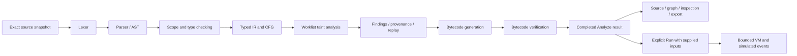

# FlowGuard — Visual Compiler, Explicit-Flow Analyzer and Bounded VM

**Course:** 4CS501CC25 Principles of Compiler Design  
**Team:** Harsh Shah and Jyot  
**Submission date:** 8 October 2026  
**Format:** Markdown, confirmed by Harsh  
**Repository:** https://github.com/harshshah-24/FlowGuard

## Abstract

FlowGuard shows how a small program moves through a real compiler. It implements lexical analysis, parsing, scope and type checking, typed intermediate representation, a control-flow graph, explicit input-flow analysis, stack-machine code generation, bytecode verification and a bounded virtual machine. The browser links source text to graph nodes, findings and bytecode. Analysis updates can be replayed separately from execution. SQL and shell operations produce simulated events, allowing the project to teach unsafe query/command construction without running external operations.

## Problem and goals

Compiler stages are often taught separately. A student may recognize tokens or grammar rules without seeing how scopes, branches, analysis and executable instructions connect. FlowGuard makes these connections visible through a practical use case: tracking input into query and command text.

The project aims to demonstrate the fundamentals rather than outsource them to an existing compiler. Its handwritten frontend and worklist solver are shared by a browser workspace and CLI. The security use case motivates data-flow analysis; it is not a production security scanner.

## Language and example

Programs use initialized `int`, `bool` and `string` variables, lexical blocks, exact types, `if/else`, `while`, and short-circuit boolean operators. Shadowing and automatic conversions are rejected. Source spans preserve original UTF-16 offsets, line endings and a leading BOM.

```fg
let name: string = input("Name");
sql_query("SELECT * FROM users WHERE name = " + name);
```

The input occurrence receives a stable static source identity. Concatenation preserves its contribution. The query call therefore gets an explicit-flow finding at its sensitive argument. Replacing it with `sql_bind("SELECT * FROM users WHERE name = ?", name);` keeps the value separate from query text and removes this modeled finding. A tainted template would still be reported. This does not prove that every possible binding implementation or SQL use is safe.

The complete grammar, signatures, arithmetic rules and caps are in [the language reference](language.md) and [the PRD](../context/flowguard_prd.md).

## Architecture and data movement



`packages/core` contains the portable synchronous engine. Browser adapters compute snapshot hashes and use independent analysis, layout and execution workers. The Node CLI uses the same core in a worker with a shared cancellation flag. There is no server-side analyzer, database, account system or saved-source history.

A request identifies the immutable source, revision and SHA-256 hash. Worker messages must match the current identity before changing UI state. Edits retire active work and clear source marks and runnable bytecode; an older snapshot may still be explicitly exported with a previous-snapshot label. Only one terminal result is accepted per request.

## Compiler fundamentals

### Lexical analysis and parsing

The lexer scans characters into tokens with exact spans. It handles comments, reserved words, integer literals and a small explicit string-escape set. It reports malformed strings, invalid characters and unterminated comments.

The handwritten parser builds a typed AST using precedence levels and associativity rules. It separates declarations, assignments, effects, blocks, conditionals and loops. Nesting, token and AST caps stop oversized input explicitly. Empty core/CLI source is valid and compiles to HALT; the UI disables Analyze for whitespace-only drafts.

### Semantic analysis

Scope resolution checks a declaration's initializer before introducing its name. The checker rejects missing names, duplicate declarations, visible-name shadowing, invalid signatures, incorrect conditions and incompatible operands. Symbols map to typed storage slots. Sibling blocks can reuse a name with different identities. Literal binding templates must contain exactly one `?`; a dynamic template receives a nonblocking uncertainty notice.

### Lowering and control flow

Lowering turns expressions into typed temporary slots and instructions. Assignments become copies; conditional expressions and loops introduce branches, merges and backedges. Short-circuit operators lower to control flow, so execution can skip the right operand. Every instruction retains its source/AST mapping. Structural CFG validation checks references and successor behavior before analysis.

### Explicit-flow worklist algorithm

For each reached node and slot, the abstract value is a finite set of input-source identities. Incoming values union reached predecessor outputs. Transfer rules are:

- Constant assignment clears the destination's sources.
- Input creates its occurrence's singleton source set.
- Copy and unary operations preserve source contributions.
- Binary operations union operand contributions.
- Branch/effect instructions preserve state; condition taint does not add implicit control taint.

A FIFO worklist starts at entry. A changed output schedules successors, with queue deduplication. Joins union may-flow contributions, while assignments kill earlier contributions on their path. Node/source identities are finite and transfers are monotone over the finite lattice, so iterative propagation reaches a fixed point. Work/time/state/membership caps also provide explicit bounded failure when a permitted workload cannot finish.

The analyzer retains both structural branch alternatives. It does not prove feasibility, solve conditions, track implicit flows or model arbitrary SQL/shell semantics. Unreachable branches and statements after an infinite loop can therefore yield false alarms. A zero-iteration loop preserves a possible incoming contribution.

### Findings, explanation and replay

After convergence, sensitive argument zero is checked for query, binding-template and shell effects. Each sink argument/rule has one finding containing all contributing sources. Print and the bound value are excluded from these sinks.

Provenance traverses dependency facts backwards using an explicit stack, deduplication and cycle markers. Bounded explanations show supporting facts without claiming that every merged fact belongs to one feasible execution. Replay records output/reachability deltas and periodic checkpoints. Trace truncation does not stop the solver or invalidate final states; omitted updates are labeled.

### Code generation and verification

Each lowered instruction emits typed stack operations with balanced IR boundaries. Constants deduplicate, jump targets are patched to recorded IR start PCs, and each bytecode PC maps back to source. Before exposing runnable bytecode, the verifier checks schemas, references, operands, reachable stack types and matching join stacks.

Definite initialization is a separate greatest-fixed-point analysis using predecessor intersections. Entry includes an external empty set; other reached nodes begin with the full slot universe, and STORE adds initialization. LOAD is checked after convergence. This is distinct from the forward union analysis used for taint. See [all opcodes and stack effects](bytecode.md).

## Runtime, reliability and security boundary

Run consumes an explicitly supplied JSON array of strings in runtime encounter order. The VM verifies again, performs exact checked signed 32-bit arithmetic, and completes only on HALT. Division truncates toward zero; remainder follows the dividend. Missing input, zero divisors and overflow have specific errors.

Execution is capped at 100,000 instructions and one second, with separate stack, input, string, storage, event and output budgets. Core-reported failures preserve preceding events and initialized top-level user values. Block locals, temporaries and declarations not reached are omitted. Terminating a browser worker cannot recover its local history.

Query and shell opcodes retain text events marked simulated. They do not contact databases or spawn commands. Source and event strings render as text. Assets are self-hosted, drafts remain in memory, and save/export are explicit downloads. Worker watchdogs and validated identities prevent stale results from changing a newer snapshot. Larger graphs use a searchable list retaining semantic edges; layout failures preserve analysis results.

## Validation and measured results

The independently labeled evaluation manifest and actual raw results are described in [evaluation](evaluation.md). It includes positive/negative flows, binding, overwrites, merges, loops, structurally infeasible cases and invalid programs. Invalid and incomplete outcomes are separate from accuracy counts. The measured fixture set is small and educational, so it does not estimate real-world scanner accuracy. Actual sink counts were TP6, FP2, FN0 and TN4 (precision75%, recall100%), with eight invalid programs and zero incomplete outcomes. All measured targets passed on the recorded Mac: engine p95 938.8ms, 200-node graph readiness1282.5ms, selection34.9ms and visible cancellation below13ms.

[Acceptance evidence](acceptance.md) maps all seventeen PRD criteria to checks and boundaries. [Testing notes](testing.md) distinguish prior remote CI from the local Phase 4 checks. Raw benchmark data retain seed, workloads, checksums, versions, hardware and ten measured runs after a warm-up. Performance results apply to the measured Mac and specified synthetic workloads.

## Deliverables and reproduction

Source code is under `packages/core`, `packages/cli` and `apps/web`. Run `npm ci`, install Playwright Chromium, then `npm run check`. Run `npm run preview` after a production build for the demonstration. `npm run evaluate` regenerates actual sample reports and labeled evaluation; `npm run benchmark` needs the production preview running at port 4173. Do not run competing heavy checks during timing measurements.

[The demo script](demo_script.md) covers the unsafe-to-binding sequence, inspection, replay, execution, errors and Stop. [Evidence files](evidence/) contain actual JSON/Markdown reports and synthetic screenshots. Required human rehearsal by both Harsh and Jyot is still a submission step; automated execution is not a substitute for their ability to explain the project.

## Limitations and conclusion

FlowGuard demonstrates a complete bounded compiler pipeline and the difference between static may-flow and concrete execution. Its novelty is the source-linked view across CFG, explanation, analysis replay, verified bytecode and simulated runtime for one small program.

It supports a deliberately small language and explicit flows only. Structural infeasibility can create false alarms; zero findings is not a universal security guarantee. No database, real command execution, bytecode import, user functions, optimizer or production deployment was added. The repository has no project license, as requested. Exact faculty submission time and required demo hardware remain unspecified.
